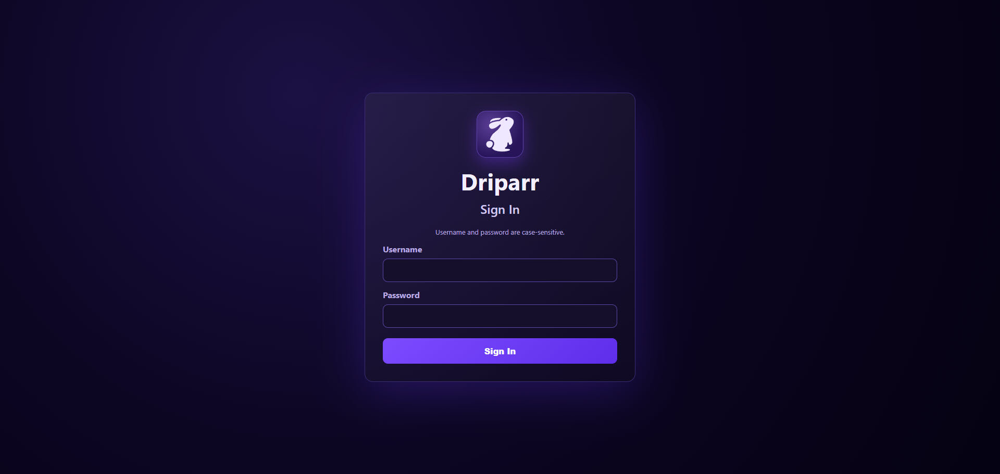
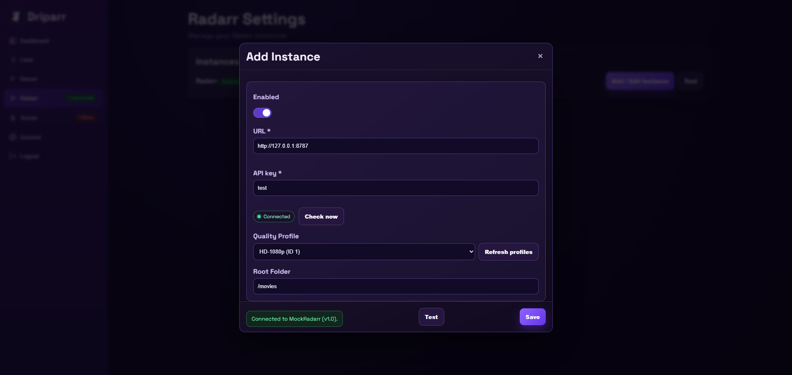
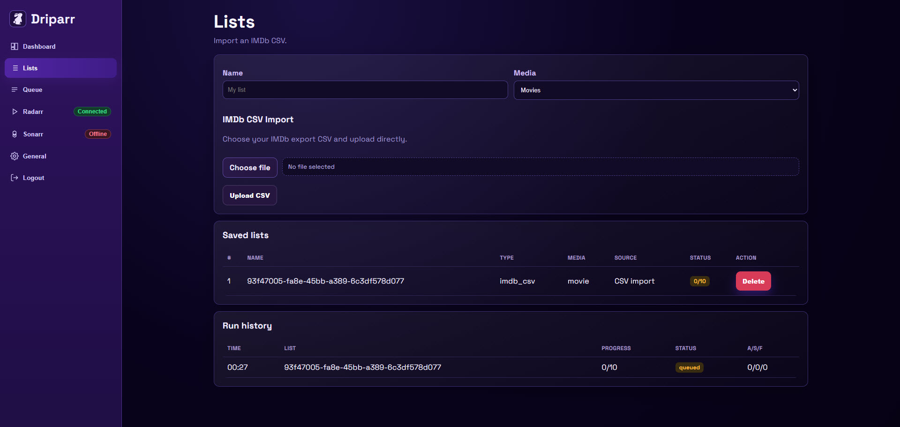
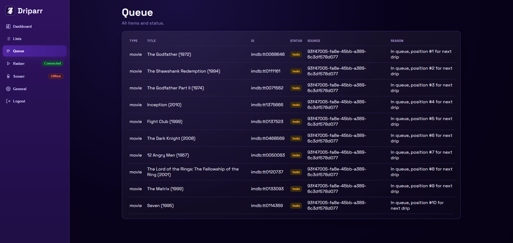
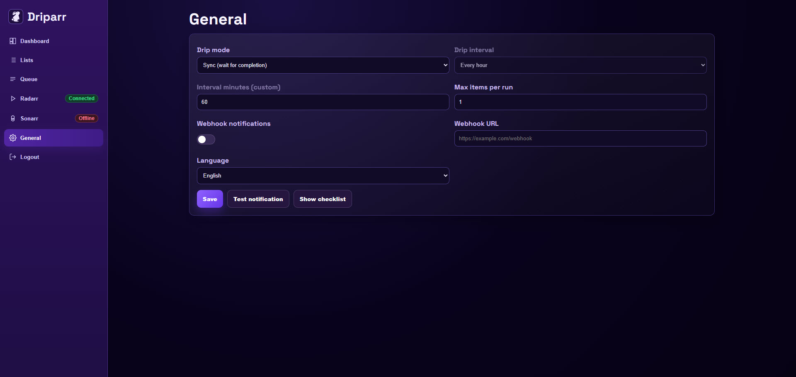
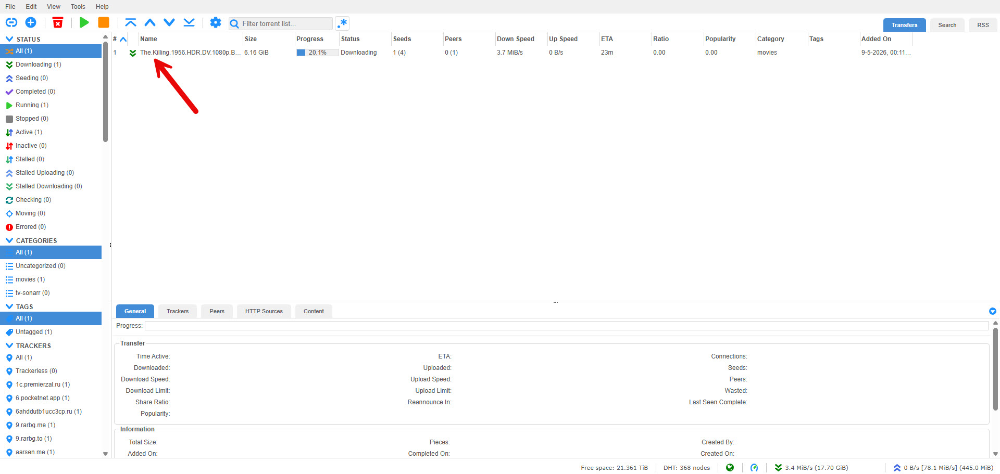

<p align="center">
  
</p>

<h1 align="center">Driparr</h1>

<p align="center">
  Drip-feed IMDb CSV lists to Radarr in small, controlled batches.
</p>

<p align="center">
  <a href="https://github.com/Sander1384/Drippar/releases/latest"></a>
  <a href="https://github.com/Sander1384/Drippar/actions/workflows/docker-publish.yml"></a>
  <a href="https://github.com/Sander1384/Drippar/pkgs/container/driparr"></a>
  
</p>

## What Is Driparr?

Driparr is a small self-hosted web app for people who keep large IMDb watchlists and want Radarr to add movies gradually instead of all at once.

Import an IMDb CSV, review the queue, choose how quickly items should drip into Radarr, and let Driparr handle the pacing. It can also skip movies that Radarr already knows about and optionally wait for the current download to finish before adding the next item.

> [!IMPORTANT]
> Driparr is intentionally focused on IMDb CSV to Radarr. It is built for predictable, visible drip-feeding rather than broad list-sync automation.

## Screenshots

<p align="center">
  
  
</p>
<p align="center">
  
  
</p>
<p align="center">
  
  
</p>

## Why Use It?

- Avoid bulk-import spikes in Radarr.
- Keep a visible queue of what will be added next.
- Add only a small number of movies per interval.
- Skip duplicates already present in Radarr.
- Use sync mode for a one-at-a-time flow.
- Run it easily in Docker or Portainer.

## Features

- IMDb CSV import for movie and series exports.
- First-run onboarding checklist.
- Radarr connection test from the web UI.
- Quality profile and root folder selection.
- Queue overview with readable status and reasons.
- Duplicate protection for existing Radarr movies.
- Timed drip mode with configurable interval and batch size.
- Sync drip mode that waits for active downloads to complete.
- Run history for imported lists.
- Optional webhook notifications.
- Mock Radarr test stack for trying Driparr without a real Radarr instance.

## Supported

| Type | Supported |
| --- | --- |
| List input | IMDb CSV export |
| Media manager | Radarr |
| Deployment | Docker Compose, Portainer |
| Image registry | GitHub Container Registry |
| Test mode | Mock Radarr stack |

## Quick Start

Create a folder for Driparr:

```bash
mkdir -p ./driparr/data
cd ./driparr
```

Create `docker-compose.yml`:

```yaml
services:
  driparr:
    image: ghcr.io/sander1384/driparr:v0.1.7
    container_name: driparr
    restart: unless-stopped
    ports:
      - "18080:8080"
    environment:
      TZ: Europe/Amsterdam
      DRIPARR_ADMIN_USERNAME: admin
      DRIPARR_ADMIN_PASSWORD: "CHANGE_ME_STRONG_PASSWORD"
      DRIPARR_SESSION_SECRET: "CHANGE_ME_RANDOM_SECRET"
    volumes:
      - ./data:/app/data
```

Start Driparr:

```bash
docker compose up -d
```

Open:

```text
http://localhost:18080
```

Change `DRIPARR_ADMIN_PASSWORD` and `DRIPARR_SESSION_SECRET` before first use.
You can generate a random 64-character session secret with the [IT Tools token generator](https://it-tools.tech/token-generator?length=64&numbers=false).

## Portainer / NAS

Use [docker-compose.portainer.yml](./docker-compose.portainer.yml) as a ready-to-edit Portainer stack.

Change at least:

- `DRIPARR_ADMIN_PASSWORD`
- `DRIPARR_SESSION_SECRET`
- the host volume path, for example `/volume1/docker/driparr/data:/app/data`

Deploy through:

```text
Portainer -> Stacks -> Add stack -> Web editor
```

Then open:

```text
http://<NAS-IP>:18080
```

## First Setup

1. Log in with the admin username and password from your compose file.
2. Enter your Radarr URL, for example `http://radarr:7878` or `http://192.168.1.50:7878`.
3. Paste your Radarr API key.
4. Click `Test` to fetch Radarr options.
5. Choose the Radarr quality profile and root folder.
6. Import an IMDb CSV from the `Lists` page.
7. Enable the worker when you are ready for Driparr to start adding items.

## Drip Modes

| Mode | Behavior |
| --- | --- |
| Timed | Adds up to `maxItemsPerRun` items every configured interval. |
| Sync | Waits until the current Radarr item appears complete before adding the next item. |

Use `Timed` for predictable batches. Use `Sync` when you want a slower one-at-a-time flow.

## Test Without Real Radarr

The repository includes a mock Radarr stack for browser testing:

```bash
docker compose -f docker-compose.test.yml up -d --build
```

Open:

```text
http://localhost:8090
```

Test login:

- username: `admin`
- password: `admin`

Stop the test stack:

```bash
docker compose -f docker-compose.test.yml down
```

## Updating

For stable releases, update the image tag in your compose file when a new release is available.

For automatic latest builds from `main`, use:

```yaml
image: ghcr.io/sander1384/driparr:latest
```

Older stacks that still use `ghcr.io/sander1384/seerrdripfeed:latest` are also updated, but new installs should use the `driparr` image name.

Then pull and restart:

```bash
docker compose pull
docker compose up -d
```

## Troubleshooting

### Radarr Test Fails

- Check that Driparr can reach the Radarr URL from inside Docker.
- Use a container name such as `http://radarr:7878` when both apps are on the same Docker network.
- Use the NAS or server IP when Radarr runs outside the Driparr stack.
- Verify the Radarr API key.

### No Items Are Added

- Confirm the queue contains `todo` items.
- Confirm the worker is enabled.
- Check whether items were skipped because they already exist in Radarr.
- In sync mode, check whether Radarr still has an active download.

### Login Stops Working

- Restart the container after changing `DRIPARR_SESSION_SECRET`.
- Make sure the admin password in your compose file is the value you expect.

## Security Notes

- Do not publish real Radarr API keys.
- Do not commit `.env`, local config files, cookies, or data volumes.
- Rotate keys or passwords that were used during testing before opening the app to other users.

## Links

- [Latest release](https://github.com/Sander1384/Drippar/releases/latest)
- [Container image](https://github.com/Sander1384/Drippar/pkgs/container/driparr)
- [Docker workflow](https://github.com/Sander1384/Drippar/actions/workflows/docker-publish.yml)

## Credits

Driparr was shaped with inspiration from the self-hosted Arr ecosystem and release-page structure from projects such as [Cleanuparr](https://github.com/Cleanuparr/Cleanuparr).
